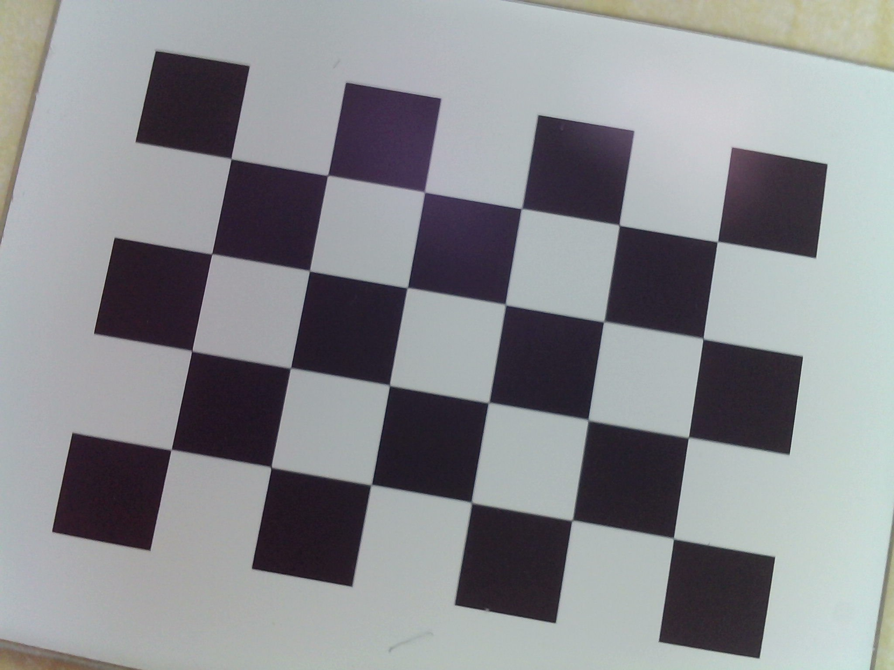
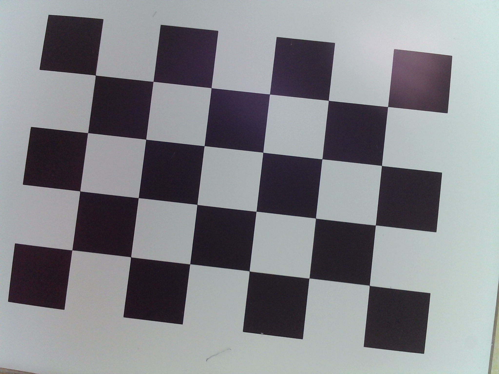
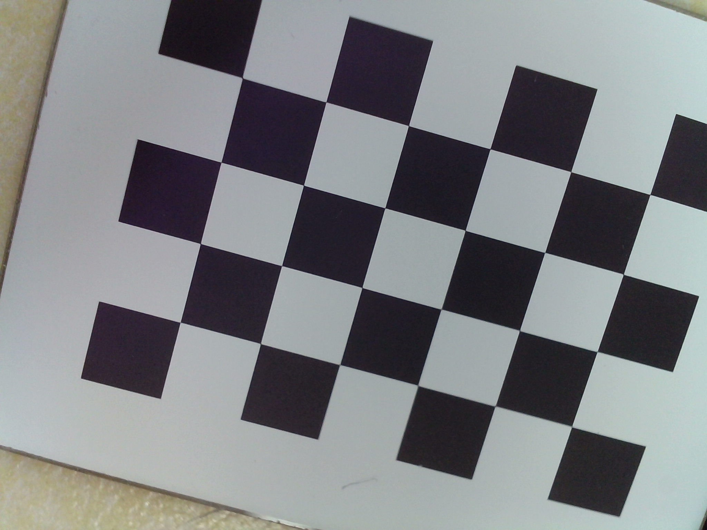
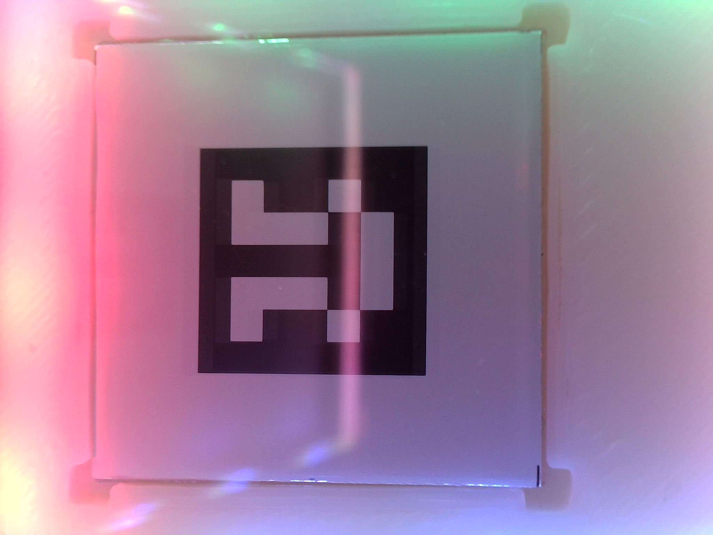
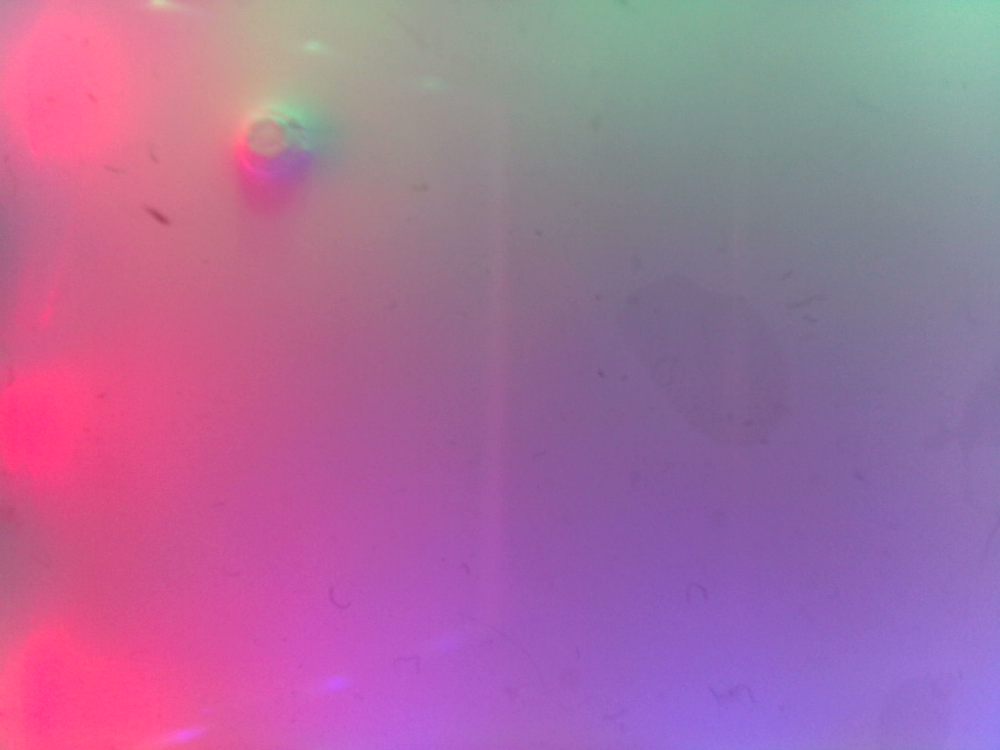

# 视触觉传感器标定程序

## 关于项目

本项目用于快速视触觉标定，将触觉传感器的像素坐标$(u,v)$转化为实际的物理坐标(x_t,y_t)（在自定义的坐标系下，一般情况下，建立的坐标系$xOy$平面与触觉传感器平面重合），本项目主要特点有：
* 将传感器内参标定和传感器原点标定分离，可以单独标定内参或在已知内参的情况下单独进行传感器原点标定。
* 提供了直接的函数接口，能够直接读取标定结果文件用于实际部署

## 准备

为了使用本标定程序，你需要准备合适大小的：
1. 棋盘格标定板（如果你需要标定相机内参的话），[下载链接](https://calib.io/pages/camera-calibration-pattern-generator)。

2. Aruco标定板用于原点标定，[下载链接](https://chev.me/arucogen/)。

3. 如果需要，可以准备验证数据，利用已知坐标的标记点对标定结果进行验证。
   
### 内参标定

拍摄不同角度的棋盘格图像（针对相机内参，不需要安装在传感器上进行拍摄），并将拍摄的图片放在`./grid_images`目录下

<figure align="center">
  
  
  
  <figcaption>不同角度的棋盘格图片</figcaption>
</figure>

### 原点标定
组装传感器，**在未安装传感器硅胶膜的情况下**，将Aruco标定板以期望建立的原点位置和坐标轴方向，固定在传感器平面上固定位置处，至少拍摄一张原点标定图像，将所有图像放到`origin_images`目录下。
<figure align="center">
  
  <figcaption>传感器拍摄得到的Arcuo标定板</figcaption>
</figure>

### 验证数据（可选，建议）

组装传感器，用已知位置的标记点按压触觉传感器，将采集到的图像保存到`./val`目录下，命名为`image_[真实x]_[真实y].jpg`
<figure align="center">
  
  <figcaption>标定验证数据，图中点坐标(5mm,-7mm)</figcaption>
</figure>

## 开始
1. 安装必要的库
```bash
pip install -r .\requirements.txt
```
2. 在`./main.py`中修改相关标定板参数

``` python
# 棋盘格参数
pattern_size = (6, 4)  # 行交叉点数量 × 列交叉点数量
square_size = 4  # 单位 mm
aruco_size = 10  # 单位 mm

```

3. 开始标定
```bash
python ./main.py
```

4. 标定验证：如果有采集验证数据，程序会跳出验证图像，手动选取验证点后（可以多次点击，以最后一次点击为准），按下`y`键确认，程序将自动计算对应选点的实际物理坐标，并根据真实值计算误差。
